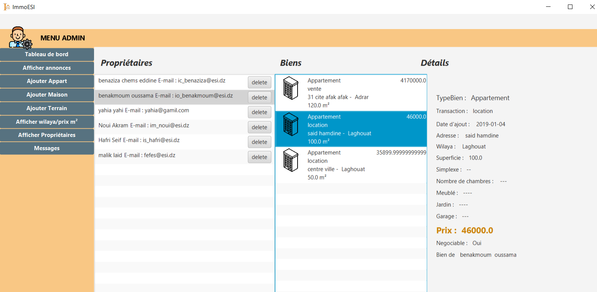

# ImmoESI_GUI_Version

ImmoESI is a java written software for real Estates agencies,
to manage their offers and proposed houses to be rented, 
sold or exchanged. It displays all categories of real estate with details
- this project is for learning purposes (it is a school assignement)

this is the view of one of the screens

